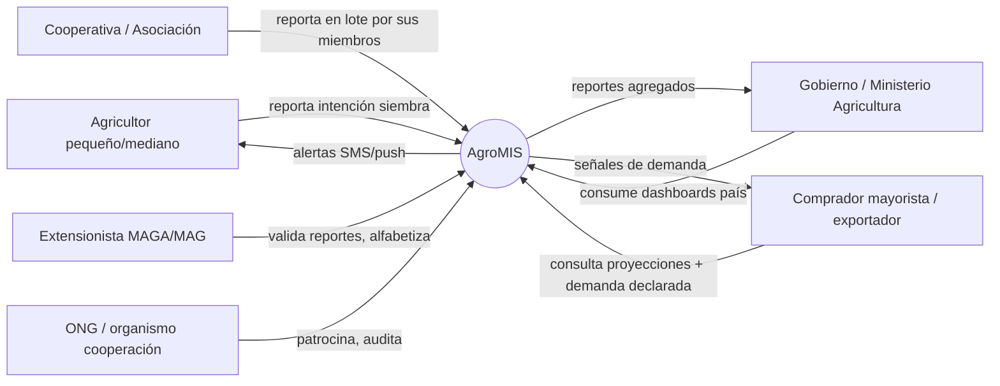
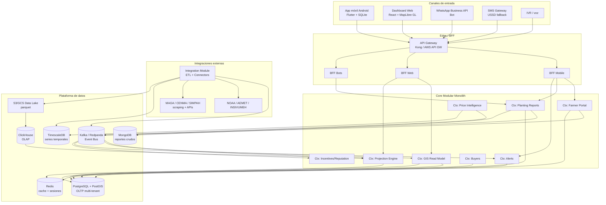
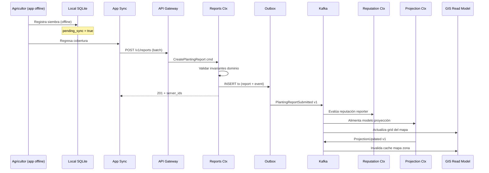
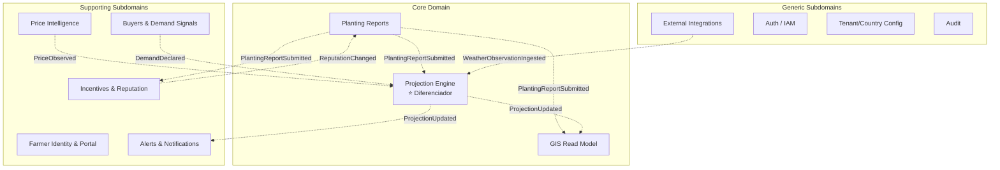
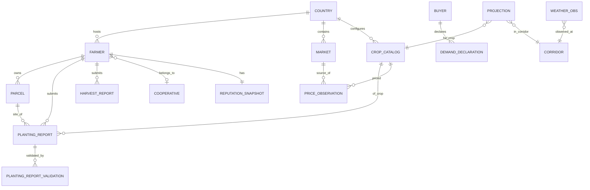
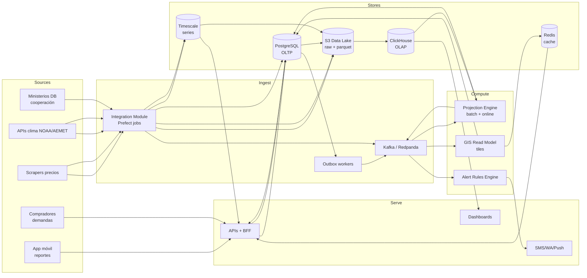
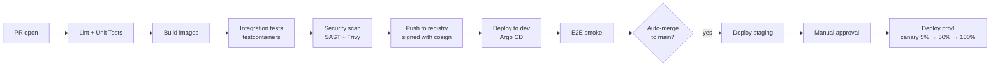
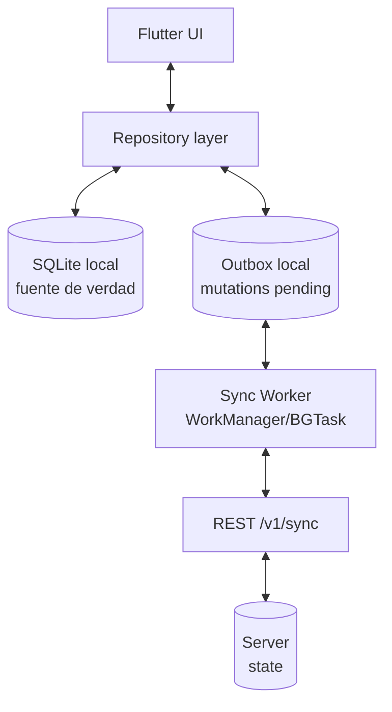
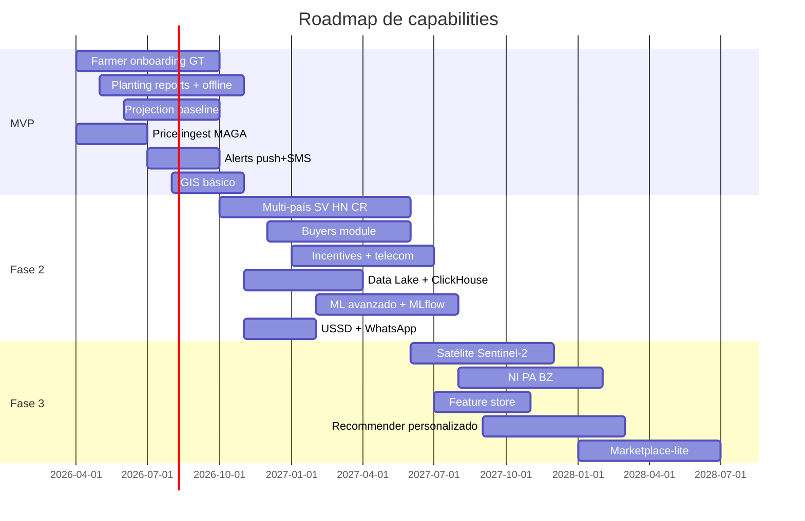

# Market Intelligence System (MIS) — Plataforma Predictiva de Oferta Agrícola Centroamericana

> **Documento de Arquitectura Técnica**
> Versión: 1.0 · Nivel: Staff/Principal Architect
> Alcance geográfico: Guatemala, El Salvador, Honduras, Nicaragua, Costa Rica, Panamá, Belice
> Autor: Arquitectura de Sistemas
> Última actualización: 2026

---

## Tabla de Contenidos

1. [Visión General del Sistema](#1-visión-general-del-sistema)
2. [Arquitectura General](#2-arquitectura-general)
3. [Diseño por Módulos (CORE)](#3-diseño-por-módulos-core)
4. [Modelo de Datos](#4-modelo-de-datos)
5. [Arquitectura de Datos](#5-arquitectura-de-datos)
6. [Infraestructura y DevOps](#6-infraestructura-y-devops)
7. [Diseño de Interfaces](#7-diseño-de-interfaces)
8. [Estrategia Offline (Crítico)](#8-estrategia-offline-crítico)
9. [Escalabilidad y Rendimiento](#9-escalabilidad-y-rendimiento)
10. [Riesgos y Trade-offs](#10-riesgos-y-trade-offs)
11. [Roadmap Técnico](#11-roadmap-técnico)

---

# 1. Visión General del Sistema

## 1.1 Descripción funcional

**AgroMIS** es una plataforma predictiva de inteligencia de mercado agrícola cuyo objetivo es **detectar desbalances de oferta y demanda antes de que ocurran** en mercados mayoristas centroamericanos. A diferencia de un marketplace (que conecta oferta y demanda ya existente) o un sistema tipo Waze (que optimiza rutas en tiempo real), AgroMIS **modela intenciones de siembra georreferenciadas** y las cruza con datos climáticos y precios históricos para **proyectar con semanas o meses de anticipación** si un cultivo específico va a sufrir sobreoferta (desplome de precio) o escasez (oportunidad).

El resultado es un **mapa de calor predictivo** — un agricultor en Chimaltenango puede ver que, a 90 días, hay un 78% de probabilidad de sobreoferta de tomate en el corredor Chimaltenango–Sacatepéquez–Guatemala, y recibir una sugerencia de siembra alternativa (por ejemplo, cebolla, cuya ventana de demanda se proyecta abierta).

El sistema es **crowdsourced-first**: la señal primaria proviene de los reportes de intención de siembra de los propios agricultores, enriquecidos con clima (NOAA/AEMET/estaciones locales), precios mayoristas (MAGA, CENMA, SIMPAH, etc.) y validación comunitaria. **No se usa imagen satelital en MVP** (decisión consciente de costos — se discute en §10).

## 1.2 Objetivos de negocio

| # | Objetivo | KPI medible |
|---|----------|-------------|
| O1 | Reducir volatilidad de precio en cultivos de la canasta básica | Varianza mensual de precio mayorista por cultivo clave (tomate, cebolla, papa, maíz, frijol) |
| O2 | Aumentar el ingreso neto del pequeño productor | Margen bruto promedio reportado por agricultores activos (encuesta trimestral) |
| O3 | Lograr masa crítica de reportes para que el modelo sea estadísticamente útil | Cobertura ≥ 5% del área cultivada en cada corredor productivo clave al cierre del año 1 |
| O4 | Establecer base de datos agronómica regional como activo estratégico | Volumen de observaciones históricas (siembras + precios + clima) acumuladas |
| O5 | Viabilidad unit-economics en zonas de baja conectividad | Costo de adquisición y retención por usuario en zonas 2G/rurales |

## 1.3 Actores principales



- **Agricultor**: usuario primario. Baja alfabetización digital en promedio, dispositivo Android gama baja, conectividad intermitente (2G/3G, WhatsApp principalmente).
- **Cooperativa**: operador de alto valor — concentra reportes de 50–500 agricultores, generalmente con mejor conectividad.
- **Extensionista**: rol institucional (ministerios, ONGs). Valida reportes sospechosos en campo, forma parte del sistema de reputación.
- **Comprador**: demanda inteligencia predictiva. Potencial monetización B2B.
- **Gobierno**: consumidor de dashboards agregados a nivel país/departamento. Potencial patrocinador.
- **Sistema** (actor no humano): motores de proyección, integradores ETL, bots de scraping de precios.

## 1.4 Problemas que resuelve

1. **Efecto "todos siembran lo mismo"**: sin señal coordinadora, los agricultores replican la decisión del vecino y del ciclo anterior, saturando el mercado y desplomando el precio.
2. **Asimetría de información**: el agricultor es el último en enterarse del precio real en el mercado mayorista; el intermediario captura la renta informativa.
3. **Ausencia de base histórica estructurada**: los ministerios de agricultura de Centroamérica tienen datos fragmentados en PDFs, Excel y sistemas legacy no interoperables.
4. **Vulnerabilidad climática no anticipada a nivel parcela**: las alertas climáticas existen a nivel nacional, no a nivel cultivo-microcuenca-fecha de siembra.
5. **Pérdida post-cosecha por falta de comprador**: cosechas maduran sin demanda identificada. (Este problema es tangencial — AgroMIS lo ataca indirectamente mediante el Módulo de Compradores; no es marketplace, es señalización.)

## 1.5 Restricciones estructurales de diseño

Estas restricciones son **no negociables** y condicionan toda la arquitectura:

| Restricción | Implicación arquitectónica |
|------------|---------------------------|
| **Bajo consumo de datos móviles** (usuarios en planes prepago de 1GB/mes o menos) | Payloads minimizados (protobuf o JSON comprimido), sin imágenes pesadas, sync delta, no long-polling |
| **Offline-first, no offline-tolerant** | La app móvil debe ser 100% funcional sin red por días; sincronización eventual con resolución de conflictos |
| **Multi-país desde día 1** | Multi-tenancy lógica por país (taxonomías de cultivos, calendarios agrícolas, idiomas, monedas, catálogos de mercados distintos) |
| **Baja alfabetización digital** | UX icónico, por voz, WhatsApp-like; SMS/USSD como canal de primera clase, no de respaldo |
| **Costo operacional bajo** | Cloud serverless donde tenga sentido; evitar licencias propietarias; FOSS-first |
| **Soberanía de datos** | Datos personales de agricultores residentes en-región cuando regulación lo exija (por ejemplo, Ley de Protección de Datos de CR) |

---

# 2. Arquitectura General

## 2.1 Tipo de arquitectura elegida

**Event-Driven Modular Monolith → Microservicios selectivos**, con los siguientes estilos combinados:

- **Domain-Driven Design (DDD)** con bounded contexts explícitos
- **CQRS** en los contextos de lectura-pesada (mapa de calor, proyecciones, dashboards)
- **Event Sourcing parcial** únicamente en el contexto de reportes de siembra (auditabilidad legal + reconstrucción del estado histórico del agricultor)
- **Outbox pattern** para publicación confiable de eventos desde transacciones SQL
- **Saga pattern** (orquestada) para flujos cross-context (por ejemplo, validación de reporte → actualización reputación → publicación a motor de proyecciones)

> **Decisión explícita**: NO se arranca en microservicios puros. Empezar con un **modular monolith** (un solo deployable, módulos con fronteras DDD duras, mismo repo) y **extraer a microservicio únicamente cuando el módulo lo exija** por razones operacionales claras (escalado independiente, tecnología distinta, o equipo dedicado). Esto evita el sobrecosto operacional de microservicios prematuros en una startup/iniciativa cooperación técnica con equipo pequeño (5–10 devs en año 1). Ver justificación en §2.3.

## 2.2 Diagrama lógico (Mermaid)

### 2.2.1 Vista de contextos (C4 nivel 2 — contenedores)



### 2.2.2 Vista de flujo de un reporte de siembra (happy path)



## 2.3 Justificación técnica de la arquitectura elegida

### ¿Por qué modular monolith y no microservicios puros?

| Factor | Microservicios puros | Modular monolith | Ganador |
|--------|---------------------|------------------|---------|
| Costo operacional (observability, mesh, CI/CD por servicio) | Alto | Bajo | **Monolith** |
| Consistencia transaccional entre contextos cercanos | Saga distribuida obligatoria | Tx local cuando aplica | **Monolith** |
| Escalado independiente de hot paths (proyección, mapa) | Nativo | Requiere refactor | Microservicios |
| Tamaño de equipo real (5–10 devs año 1) | Sobredimensionado | Ajustado | **Monolith** |
| Evolución futura | Se necesita rediseño | Extracción gradual por módulo | **Monolith** |

La regla de extracción es explícita: **un módulo se extrae a microservicio cuando (a) su perfil de carga diverge del core en ≥ 10x, (b) requiere un stack distinto, o (c) tiene un ciclo de release desacoplado**. Candidatos naturales a extracción en Fase 2: `Projection Engine` (Python/ML), `Integration Module` (perfil ETL batch), `GIS Read Model` (caché y tiling).

### ¿Por qué event-driven?

- Los contextos core (reportes → proyección → mapa → alertas) tienen **acoplamiento temporal asíncrono**: una proyección no necesita actualizarse en la misma transacción que el reporte.
- Permite **reprocesamiento histórico** (re-entrenar modelo y recalcular proyecciones desde eventos pasados sin tocar OLTP).
- Facilita **auditoría regulatoria**: cada reporte es un evento inmutable.
- Habilita desacoplamiento con integraciones externas flakey (APIs gubernamentales caídas no bloquean el flujo del agricultor).

### ¿Por qué CQRS en lectura GIS y proyecciones?

- El mapa de calor se consulta **miles de veces por minuto** (agricultores abriendo la app) y se escribe relativamente poco (agregaciones de reportes).
- El modelo de lectura óptimo (tiles vectoriales H3-indexados pre-agregados) difiere radicalmente del modelo de escritura (reportes individuales con geometría).
- Separar read/write permite desnormalizar agresivamente sin contaminar el modelo de dominio.

### ¿Por qué DDD y bounded contexts?

- El dominio agrícola tiene **lenguaje ubicuo muy rico y ambiguo** (una "siembra" significa cosas distintas para el agricultor, el agrónomo, el estadístico y el comprador). Los bounded contexts hacen explícita la traducción.
- Multi-país implica **variabilidad semántica**: una "manzana" en Centroamérica es unidad de área (~0.7 Ha); en otros países es una fruta. DDD disciplina estas divergencias vía Anti-Corruption Layers.
- Permite alinear equipos a contextos (Conway's law inverso).

## 2.4 Bounded Contexts (DDD)



**Clasificación estratégica** (según Evans):

- **Core Domain** (donde está la ventaja competitiva): `Projection Engine` + `Planting Reports` + `GIS Read Model`. Aquí se invierte el mejor talento, se construye in-house, no se compra.
- **Supporting Subdomains**: funcionalidades importantes pero no diferenciadoras. Se construyen in-house pero con pragmatismo (no sobre-ingeniería).
- **Generic Subdomains**: Auth, Audit, config — se prefieren soluciones existentes (Keycloak, librerías de auditoría).

### Context Map

| Context A | Context B | Relación | Notas |
|-----------|-----------|----------|-------|
| Reports → Projection | Customer/Supplier (upstream/downstream) | Events vía Kafka | Projection depende de la calidad de Reports |
| Reports → Reputation | Customer/Supplier | Events | Reputation es downstream |
| Projection → GIS | Customer/Supplier | Events | GIS es read model |
| Integration → Projection | Anti-Corruption Layer | ACL en Integration | Traduce formatos heterogéneos (NOAA, MAGA, etc.) |
| Farmer Portal → Reports | Shared Kernel | IDs de agricultor compartidos | Único caso de shared kernel justificado |
| Tenant Config → * | Open-Host Service | REST/gRPC interno | Todos los contextos consumen country/tenant config |
| Buyers → Projection | Conformist | Buyers consume eventos tal-cual | No quiere complejidad |

## 2.5 Patrones utilizados (resumen)

| Patrón | Dónde | Por qué |
|--------|-------|---------|
| **Outbox** | Reports, Price Intelligence | Garantiza "exactly-once-like" entre DB y Kafka |
| **Saga (orquestada)** | Flujo de incentivos post-validación | Requiere compensación si validación falla |
| **Event Sourcing** | Reports (solo) | Auditabilidad legal + reconstrucción histórica |
| **CQRS** | GIS Read Model, Projection queries | Performance lectura |
| **Anti-Corruption Layer** | Integration Module | Aislar formatos externos |
| **Circuit Breaker** | Llamadas a APIs gubernamentales | Flakiness conocida |
| **Bulkhead** | Pools de conexión por integración | Evitar que un MAGA caído bloquee a NOAA |
| **Idempotency Keys** | Todos los endpoints de mutación móviles | Retries seguros en redes inestables |
| **CRDT (conceptual)** | Sync offline de reportes | Merge de reportes editados offline |
| **Tenant Isolation: Shared DB + Discriminator** | OLTP multi-país | Costo/complejidad óptimos; ver §4 |

---

# 3. Diseño por Módulos (CORE)

> Cada módulo se documenta como un **bounded context** con sus responsabilidades, puertos (APIs), eventos publicados/consumidos, invariantes de dominio, y consideraciones de escalabilidad.

## 3.1 Visualizador GIS (Mapa de Calor)

### Descripción

Servicio de lectura optimizado que expone un **mapa de calor predictivo** multi-capa: (a) intenciones de siembra agregadas por cultivo y ventana temporal, (b) proyecciones de sobreoferta/escasez con intervalo de confianza, (c) precios mayoristas recientes, (d) alertas climáticas activas. Usa **indexación geoespacial H3** (Uber) por su regularidad hexagonal — superior a quadkeys para cálculos de vecindad y agregación.

### Responsabilidades

- Servir **tiles vectoriales MVT (Mapbox Vector Tiles)** generados dinámicamente o pre-generados por zoom level.
- Mantener un **modelo de lectura desnormalizado** actualizado por eventos.
- Proveer **queries de agregación** (por ejemplo: "total hectáreas de tomate sembradas en corredor X en los últimos 30 días").
- Implementar **k-anonimato** (§3.1 seguridad): nunca exponer parcelas individuales — agregación mínima de 5 reportes por celda.
- Ocultar/anonimizar reportes cuando el agregado de una celda H3 es menor al umbral k.

### Casos de uso

| UC | Actor | Descripción |
|----|-------|-------------|
| UC-GIS-01 | Agricultor | Ver mapa de calor de sobreoferta proyectada a 30/60/90 días en su región |
| UC-GIS-02 | Comprador | Filtrar mapa por cultivo + rango fechas cosecha proyectada |
| UC-GIS-03 | Gobierno | Consumir endpoint agregado por departamento/municipio |
| UC-GIS-04 | Extensionista | Ver puntos individuales **solo si tiene permiso explícito y scope por jurisdicción** |

### APIs

```http
GET /v1/gis/tiles/{z}/{x}/{y}.mvt
  ?layer=projection|reports|prices|alerts
  &crop=TOMATO
  &window=90d
  &country=GT
Accept: application/vnd.mapbox-vector-tile

GET /v1/gis/aggregate
  ?bbox=14.5,-90.8,14.8,-90.4
  &resolution=h3-7
  &crop=TOMATO
  &metric=surplus_probability
Response: {
  "cells": [
    { "h3": "872830828ffffff", "value": 0.78, "n_reports": 142, "ci_low": 0.65, "ci_high": 0.88 }
  ],
  "generated_at": "2026-04-20T14:32:11Z",
  "ttl_seconds": 900
}

GET /v1/gis/layers
Response: catálogo de capas disponibles para el tenant
```

**Contrato tile (MVT)**: las features incluyen solo `{ h3, crop_code, metric_value, bucket_low, bucket_high }`. **No se incluyen IDs de agricultor ni coordenadas de parcela.**

### Eventos

**Consume**:
- `PlantingReportSubmitted.v1` → actualiza agregados de intención
- `PlantingReportValidated.v1` → promueve reporte a agregado "validado"
- `ProjectionUpdated.v1` → recalcula capa de proyección
- `PriceObserved.v1` → actualiza capa de precios
- `WeatherAlertIssued.v1` → actualiza capa de alertas

**Publica**: ninguno (es un read model puro).

### Dependencias

- `PostGIS` (fuente de verdad geoespacial para queries complejas)
- `Redis` (cache de tiles calientes)
- `ClickHouse` (para agregados OLAP grandes)
- Librería `h3-java` o `h3-py`
- `Tegola` o servicio custom Go para generar MVT

### Tecnologías sugeridas

- **Lenguaje**: Go (tile server — baja latencia, alto throughput) o Java (si se mantiene stack Quarkus del equipo)
- **Frontend**: MapLibre GL JS (fork OSS de Mapbox) — evita licencia propietaria
- **CDN**: CloudFront/Cloudflare para tiles cachéables
- **Tile format**: MVT (binario, compacto, adecuado para 2G/3G)

### Consideraciones de escalabilidad

- **Tiles pre-renderizados** para zoom 4–9 (país/región), **dinámicos con cache** para zoom 10–14 (parcela).
- **Cache hierárquico**: CDN (público, sin auth) → Redis (por tenant) → PostGIS.
- **Tile expiration**: 15 min para capa de reportes, 1 hora para proyecciones, 5 min para alertas climáticas activas.
- **k-anonimato**: umbral configurable por tenant/país (default k=5); si una celda tiene < k reportes, se omite o se fusiona con vecinos hasta alcanzar k.
- **Rate limiting por IP + por tenant** en el tile server; tiles son cacheables y baratos pero DoS es trivial.

---

## 3.2 Portal del Agricultor

### Descripción

Contexto que maneja la **identidad, perfil, parcelas y sesión** del agricultor. No confundir con `Auth` (generic subdomain): este contexto modela el **agricultor como entidad de dominio** (historial, parcelas, reputación agregada, preferencias de cultivo, canal de contacto preferido).

### Responsabilidades

- Gestión de ciclo de vida del agricultor: onboarding (muchas veces asistido por extensionista), verificación (teléfono vía OTP, documento opcional), actualización de perfil.
- Gestión de **parcelas**: polígono geo, área, altitud, cultivo histórico, propiedad/arriendo.
- Configuración de preferencias: idioma (es/en/indígenas en roadmap), canal preferido (push/SMS/WhatsApp/voz), frecuencia de alertas.
- **Onboarding offline**: un extensionista puede registrar 50 agricultores sin red; sync posterior.
- Integración con **cooperativas** (un agricultor puede pertenecer a una cooperativa que reporta por él).

### Casos de uso

- UC-FAR-01: Registro vía app móvil con verificación por SMS OTP
- UC-FAR-02: Registro asistido por extensionista en campo (firma digital opcional)
- UC-FAR-03: Actualizar parcela (dibujar polígono en mapa o grabar perímetro caminando)
- UC-FAR-04: Cambiar canal de alertas a SMS por restricción de datos
- UC-FAR-05: Vincular a cooperativa vía código QR

### APIs

```http
POST /v1/farmers
  Body: { name, phone, country, preferred_channel, language, referral_code? }
  Idempotency-Key: required
  Response: 201 + farmer_id (UUID v7 para ordenamiento temporal)

POST /v1/farmers/{id}/parcels
  Body: {
    name,
    geometry: GeoJSON Polygon,
    area_ha: number,
    tenure: "OWNED"|"RENTED"|"SHARED",
    altitude_m?: number
  }

PATCH /v1/farmers/{id}/preferences
  Body: { channel?, language?, alert_radius_km? }

POST /v1/farmers/{id}/link-cooperative
  Body: { cooperative_code }
```

### Eventos publicados

- `FarmerRegistered.v1`
- `FarmerParcelAdded.v1`
- `FarmerParcelUpdated.v1`
- `FarmerPreferencesChanged.v1`
- `FarmerLinkedToCooperative.v1`

### Dependencias

- `Auth` (Keycloak) para tokens
- `Tenant Config` para reglas por país (formato de teléfono, documento nacional, idiomas)
- `Notification Channel Registry` (en Alerts context)

### Tecnologías sugeridas

- Java + Quarkus (stack del equipo) o Kotlin + Spring Boot
- PostgreSQL con PostGIS para parcelas
- Keycloak como IDP

### Consideraciones de escalabilidad

- Entidad de escritura moderada (~cientos de miles en 3 años); no es hot path.
- **Particionamiento por country_code** en PostgreSQL si un país supera 1M de registros.
- **Invalidación de cache cuidadosa**: cambio de preferencias debe invalidar cache de Alerts context <2s.

---

## 3.3 Motor de Proyecciones y Cálculo (Projection Engine)

### Descripción

**Core Domain — es el diferenciador competitivo del sistema.** Modela y predice:

1. **Volumen esperado de cosecha** por cultivo × celda H3 × ventana temporal, a partir de reportes de intención de siembra + rendimientos esperados (kg/ha) × clima.
2. **Probabilidad de sobreoferta/escasez** comparando oferta proyectada vs. demanda histórica estacional + demanda declarada por compradores.
3. **Sugerencias de cultivo alternativo** (recommender) para ventanas donde se proyecta sobreoferta.

### Responsabilidades

- Ejecutar **pipeline de features**: unir reportes, clima (temperatura/precipitación acumulada), precios históricos, calendario agrícola por país, estacionalidad de demanda.
- Ejecutar **modelos predictivos** (inicialmente baselines estadísticos — ARIMA/Prophet/SARIMA por cultivo × corredor; evolución a gradient boosting y redes neuronales en Fase 2).
- Publicar `ProjectionUpdated` cuando cambia un valor significativamente (> umbral de varianza).
- Mantener **versionado de modelos** (cada proyección referencia `model_version`).
- Exponer **explicabilidad** (SHAP values o similar) para construir confianza con extensionistas y gobierno.

### Casos de uso

- UC-PRJ-01: Recalcular proyecciones cuando ingresa lote de reportes nuevos (trigger por evento o batch diario)
- UC-PRJ-02: Recalcular cuando cambia pronóstico climático significativamente
- UC-PRJ-03: Responder query "¿cuál es la proyección de oferta de tomate en corredor X a 60 días?"
- UC-PRJ-04: Generar sugerencia de cultivo alternativo para una parcela específica

### APIs

```http
GET /v1/projections
  ?crop=TOMATO
  &corridor=GT-CHIMALTENANGO
  &horizon_days=60
Response: {
  "crop": "TOMATO",
  "corridor": "GT-CHIMALTENANGO",
  "horizon_days": 60,
  "projected_volume_mt": 4820,
  "historical_demand_mt": 3100,
  "surplus_probability": 0.78,
  "confidence_interval": [0.65, 0.88],
  "model_version": "prophet-tomato-gt-v3.2",
  "computed_at": "2026-04-20T03:00:00Z",
  "features_used": ["planting_reports_90d", "noaa_gfs_14d", "price_history_5y"]
}

POST /v1/projections/what-if
  Body: {
    parcel_id,
    candidate_crops: ["ONION", "CARROT", "POTATO"],
    planting_date: "2026-05-15"
  }
Response: ranking de cultivos por expected_margin + risk_score

POST /v1/projections/recompute  (admin, async)
  Body: { country?, crop?, since_date? }
Response: 202 + job_id
```

### Eventos

**Consume**:
- `PlantingReportSubmitted.v1`, `PlantingReportValidated.v1`
- `PriceObserved.v1`
- `WeatherObservationIngested.v1`, `WeatherForecastUpdated.v1`
- `DemandDeclared.v1` (de Buyers context)

**Publica**:
- `ProjectionUpdated.v1` — schema clave (ver §3.3 Contratos)
- `ProjectionModelRetrained.v1`
- `AnomalyDetected.v1` (cuando proyección cambia drásticamente)

### Dependencias

- `PostgreSQL` (proyecciones persistidas para CQRS)
- `TimescaleDB` (features temporales: clima, precios)
- `ClickHouse` (features masivas históricas)
- `S3 Data Lake` (snapshots de training data)
- MLflow (registry de modelos)

### Tecnologías sugeridas

- **Lenguaje**: Python (ecosistema ML — pandas, statsmodels, prophet, xgboost, scikit-learn, PyTorch en Fase 2)
- **Orquestación**: Prefect o Dagster (más modernos que Airflow para pipelines de datos con dependencias)
- **Serving**: FastAPI para el endpoint de proyecciones; modelo en RAM o en MLflow model serving.
- **Feature store**: Feast (OSS) en Fase 2 cuando features se reusen entre modelos.

### Consideraciones de escalabilidad

- Inferencia es **barata** (la proyección ya está pre-calculada — se sirve desde PostgreSQL). El endpoint es hot path pero solo lee.
- **Training es caro** — se ejecuta en batch nocturno en cluster efímero (Spark o Dask sobre Kubernetes) con spot instances.
- **Cold-start problem**: un corredor con < 20 reportes no tiene señal suficiente. Estrategia: fallback a priors bayesianos construidos desde datos históricos de ministerios + cultivos similares de corredores vecinos. Documentar explícitamente esta incertidumbre en la respuesta API (`confidence_interval`).
- **Drift detection**: monitoreo continuo de error de predicción vs. realidad (una vez que se cierra la ventana de cosecha). Alertar si MAPE > 30% para retraining.

### Ejemplo de feature engineering (Python)

```python
def build_projection_features(
    corridor: str,
    crop: str,
    as_of: date,
    horizon_days: int
) -> pd.DataFrame:
    reports = fetch_planting_reports(
        corridor=corridor, crop=crop,
        since=as_of - timedelta(days=180)
    )
    weather = fetch_weather_aggregates(
        corridor=corridor,
        since=as_of - timedelta(days=365),
        until=as_of + timedelta(days=horizon_days),
    )
    prices = fetch_price_history(
        crop=crop, country=corridor.split("-")[0],
        years_back=5,
    )
    demand = fetch_declared_demand(crop=crop, corridor=corridor)

    return (
        reports
        .pipe(add_expected_yield, crop=crop, corridor=corridor)
        .pipe(join_weather_features, weather=weather)
        .pipe(join_price_seasonality, prices=prices)
        .pipe(join_demand_signal, demand=demand)
        .pipe(add_calendar_features, country=corridor.split("-")[0])
    )
```

---

## 3.4 Motor de Inteligencia de Precios

### Descripción

Contexto que **ingiere, normaliza, valida y sirve** precios mayoristas de cultivos en mercados referentes por país. Es el segundo insumo crítico del `Projection Engine` y alimenta directamente el mapa de calor.

### Responsabilidades

- **Ingesta de precios**: scraping de portales ministeriales (MAGA GT, SIMPAH HN, CENADA CR) + integración con APIs oficiales donde existan + reportes manuales de operadores de mercado (crowdsourcing de nivel 2).
- **Normalización** multi-país: unidades de medida (quintal, qq, libra, kg, lb/arroba), monedas (GTQ, HNL, CRC, NIO, PAB, USD, BZD), calidades/grados, mercado de referencia.
- **Detección de outliers** (precios imposibles por error de tipeo o cambio de moneda).
- **Series temporales limpias** para consumo por el motor de proyección y dashboards.
- **API de consulta** para app móvil y web.

### Casos de uso

- UC-PRC-01: Ingesta automatizada diaria desde MAGA (scraping + parser HTML robusto)
- UC-PRC-02: Reporte manual de precio por operador verificado (reputación alta)
- UC-PRC-03: Consulta de serie temporal por cultivo × mercado × ventana
- UC-PRC-04: Alerta de precio anómalo detectado (spike > 3σ)

### APIs

```http
GET /v1/prices/series
  ?crop=TOMATO&market=GT-CENMA&from=2025-01-01&to=2026-04-20&grade=FIRST
Response: {
  "crop": "TOMATO",
  "market": "GT-CENMA",
  "currency": "GTQ",
  "unit": "KG",
  "points": [
    { "date": "2026-04-18", "price_min": 5.20, "price_max": 6.80, "price_mode": 6.00, "source": "MAGA", "confidence": "HIGH" }
  ]
}

GET /v1/prices/latest?country=GT
Response: mapa cultivo -> último precio observado en mercados del país

POST /v1/prices/manual
  Body: { market_id, crop, price, currency, unit, observed_at, source_type: "OPERATOR"|"AGRICULTOR" }
  Auth: requiere reputación mínima
```

### Eventos

**Publica**:
- `PriceObserved.v1`
- `PriceAnomalyDetected.v1`

**Consume**:
- `MarketConfigUpdated.v1` (desde Tenant Config)

### Dependencias

- `TimescaleDB` (series temporales)
- `Redis` (cache último precio)
- Servicio de FX rates (para normalización opcional a USD)
- Playwright/Scrapy para scraping

### Tecnologías sugeridas

- **Ingesta**: Python (Scrapy + Playwright para portales con JS)
- **Servicio de query**: Go o Java (baja latencia)
- **Storage**: TimescaleDB (hypertables particionadas por mes)

### Consideraciones de escalabilidad

- Volumen: ~5K–20K precios/día regional. No es problema de throughput sino de **robustez** (los sitios de origen cambian layouts).
- **Parsers versionados**: cada scraper tiene contrato de test unit + test de snapshot HTML; ruptura hace fallar pipeline con alerta.
- **Cache de último precio**: Redis con TTL 15 min por mercado × cultivo.
- **Compliance de scraping**: respetar `robots.txt`, rate limits, preferir APIs oficiales. Documentar convenios con ministerios (ruta preferida).

---

## 3.5 Módulo de Alertas y Notificaciones

### Descripción

Contexto responsable de **evaluar reglas, resolver el canal óptimo, y entregar notificaciones** a agricultores y compradores. Multi-canal (push, SMS, WhatsApp, voz/IVR, USSD).

### Responsabilidades

- Motor de reglas: "notificar a agricultores en radio X km si se proyecta sobreoferta > 70% a 60 días para un cultivo que reportaron sembrar".
- Resolución de **canal óptimo** por preferencia + disponibilidad + costo (SMS cuesta, push es gratis).
- **Rate limiting por usuario** (máximo N alertas/día para evitar fatiga → churn).
- Deduplicación (misma alerta no se manda dos veces).
- Multi-idioma con plantillas.
- **Tracking de entrega + apertura + acción** para feedback loop.

### Casos de uso

- UC-ALT-01: Alerta personalizada de sobreoferta proyectada en cultivo del agricultor
- UC-ALT-02: Alerta climática (helada, sequía) para parcelas en zona afectada
- UC-ALT-03: Notificación a comprador de cosecha próxima en zona de interés
- UC-ALT-04: Digest semanal vía SMS para usuarios de baja conectividad

### APIs

```http
POST /v1/alerts/subscribe
  Body: { farmer_id, alert_type, parameters: { crop?, radius_km?, threshold? } }

GET /v1/alerts/inbox?farmer_id=...
Response: lista paginada de alertas recibidas (incluye leídas/no leídas)

POST /v1/alerts/{id}/acknowledge

PATCH /v1/alerts/preferences
  Body: { max_per_day, quiet_hours, preferred_channel }
```

### Eventos

**Consume**:
- `ProjectionUpdated.v1`
- `WeatherAlertIssued.v1`
- `PriceAnomalyDetected.v1`
- `DemandDeclared.v1` (para alertas a compradores, no, a agricultores con cosecha cercana al cultivo demandado)

**Publica**:
- `NotificationDispatched.v1`
- `NotificationDelivered.v1`
- `NotificationFailed.v1`

### Dependencias

- Proveedores: Twilio (SMS global), Africa's Talking equivalente regional (USSD), Meta WhatsApp Business API, Firebase Cloud Messaging (push Android)
- `Redis` (rate limiting + deduplicación con bloom filters)
- `PostgreSQL` (inbox persistente)

### Tecnologías sugeridas

- Rule engine: Drools (si Java), o custom con DSL simple
- Template engine: Handlebars / Mustache (plantillas por idioma)

### Consideraciones de escalabilidad

- Pico esperado: alerta climática masiva puede disparar 100K+ notificaciones en minutos.
- **Worker pool con backpressure**: Kafka consumer group escala horizontal; rate limit por proveedor externo.
- **Cost guard**: hard cap diario por tenant para SMS (son caros); fallback a push/WhatsApp cuando se supera umbral.
- **Observabilidad crítica**: métrica de entrega por canal × país (SMS en zonas rurales tiene tasas de entrega variables).

---

## 3.6 Módulo de Integración (satélite, clima, mercados)

### Descripción

Contexto **Generic/Supporting** que actúa como **Anti-Corruption Layer** contra fuentes externas. Aísla al core de formatos cambiantes, APIs caídas, y semánticas divergentes.

### Responsabilidades

- Conectores por fuente: clima (NOAA GFS, ECMWF, estaciones INSIVUMEH/MARN/SINAC), mercados (MAGA GT, SIMPAH HN, CENADA CR, SEPSA CR, SEPSA NI), futuro: satélite (Sentinel-2 vía Copernicus).
- **Scheduling**: cada fuente tiene su cadencia (clima cada 6h, precios diarios, satélite cada 5 días si se incorpora).
- **Idempotencia de ingesta** (si corre dos veces, no duplica).
- **Backfill** (capacidad de re-ingestar rangos históricos).
- **Traducción a eventos de dominio** (`WeatherObservationIngested.v1` es un evento de dominio, no un DTO de NOAA).

### Casos de uso

- UC-INT-01: Pipeline diario de scraping MAGA (cron 04:00 UTC)
- UC-INT-02: Pull NOAA GFS cada 6h (00/06/12/18 UTC)
- UC-INT-03: Backfill de precios 2020–2025 por cooperación con ministerio
- UC-INT-04: Circuit breaker: MAGA caído → degradar gracefully, no bloquear downstream

### APIs (internas)

```http
POST /v1/integration/jobs/trigger
  Body: { source: "MAGA_GT", job_type: "DAILY_PRICES", since?: date, until?: date }
Response: 202 + job_id

GET /v1/integration/sources/status
Response: [{ source, last_success, last_failure, circuit_state, next_run }]
```

### Eventos

**Publica**:
- `WeatherObservationIngested.v1`
- `WeatherForecastUpdated.v1`
- `WeatherAlertIssued.v1`
- `PriceObserved.v1` (también puede venir directo de Price Intelligence cuando es manual)
- `IntegrationJobCompleted.v1` / `IntegrationJobFailed.v1`

### Dependencias

- Prefect/Dagster para orquestación
- S3/GCS para almacenamiento de raw payloads (trazabilidad + replay)
- Circuit breaker lib (resilience4j para Java, tenacity para Python)

### Tecnologías sugeridas

- **Python** para scrapers (Scrapy, Playwright, BeautifulSoup)
- **Go** para integradores de alto throughput (clima NOAA GFS son archivos grandes)
- **Orquestación**: Prefect preferido por DX moderno

### Consideraciones de escalabilidad

- Scrapers son **frágiles por naturaleza**. Monitoreo por source con alerta on-call.
- **Quota management**: APIs gubernamentales tienen rate limits no documentados; implementar backoff exponencial + jitter.
- **Fallback a caché última-buena** en caso de degradación prolongada.

---

## 3.7 Módulo de Compradores

### Descripción

Contexto que gestiona **compradores mayoristas, exportadores y procesadores** que declaran señales de demanda al sistema. Alimenta el motor de proyección con el lado de la demanda (contraparte de los reportes de siembra del lado oferta). **No es marketplace** — no facilita transacciones, solo señalización.

### Responsabilidades

- Registro y verificación de compradores (KYC simple: razón social, NIT/RTN/RUT, país).
- Declaración de demanda: "necesito 200 tm de tomate grado A en corredor X entre 15-jun y 30-jun".
- **Matching con proyecciones** (si hay cosecha proyectada que calza, notificar al comprador — no al agricultor individual por privacidad).
- **Dashboard de compradores**: ver proyecciones filtradas por su interés.
- **Monetización (futuro)**: suscripción a alertas premium, datos agregados.

### Casos de uso

- UC-BUY-01: Registro de comprador con verificación documental
- UC-BUY-02: Declaración de demanda con ventana temporal y grado
- UC-BUY-03: Dashboard con proyecciones relevantes a su interés
- UC-BUY-04: Alerta proactiva: "se proyecta cosecha que calza con tu demanda"

### APIs

```http
POST /v1/buyers/demands
  Body: {
    crop, grade?, volume_mt, corridor,
    window_from, window_to, price_reference?
  }

GET /v1/buyers/dashboard
  Response: proyecciones agregadas filtradas por demandas declaradas

GET /v1/buyers/demands/{id}/matches
  Response: corredores + fechas donde la proyección de oferta calza
```

### Eventos

**Publica**: `DemandDeclared.v1`, `DemandMatched.v1`, `BuyerVerified.v1`

**Consume**: `ProjectionUpdated.v1`

### Dependencias

- `PostgreSQL`
- `Projection Engine` (read)

### Tecnologías sugeridas

- Mismo stack que Farmer Portal (Java/Quarkus)

### Consideraciones de escalabilidad

- Volumen bajo (cientos a miles de compradores regionalmente). No es hot path.
- **Críticamente**: privacidad. Nunca exponer identidad de agricultores individuales a compradores. Solo agregados por celda H3 con k-anonimato.

---

## 3.8 Módulo de Incentivos / Validación (Reputación)

### Descripción

Contexto que **incentiva reportes veraces y continuos** mediante un sistema de reputación y recompensas. La calidad del sistema entero depende de la calidad de los reportes crowdsourced — por tanto este módulo es **indirectamente core**.

### Responsabilidades

- Mantener **score de reputación** por agricultor (0–1000).
- Ajustar score basado en: (a) consistencia temporal (reporta regularmente), (b) verificación post-hoc (el reporte matchea precios/cosechas observadas), (c) validación por extensionista en campo, (d) validación cruzada por vecinos.
- Otorgar **badges** (gamification ligero).
- Integrar con programa de **incentivos**: saldo de datos móviles, puntos canjeables, priorización en dashboards de compradores.
- Detección de **fraude** (agricultores que reportan masivamente para inflar datos — detección por patrones).

### Casos de uso

- UC-INC-01: Agricultor reporta siembra → +10 pts tentativos
- UC-INC-02: Extensionista valida en campo → +50 pts confirmados
- UC-INC-03: Al cerrar ventana de cosecha, si el volumen reportado de cosecha calza con lo esperado del reporte de siembra, +30 pts
- UC-INC-04: Detección de patrón fraudulento (50 reportes en 10 minutos de un mismo dispositivo) → congelamiento + revisión

### APIs

```http
GET /v1/reputation/farmers/{id}
Response: { score, tier: BRONZE|SILVER|GOLD|PLATINUM, badges: [...], history: [...] }

POST /v1/reputation/validations  (extensionista)
  Body: { report_id, verdict: "CONFIRMED"|"REJECTED"|"PARTIAL", field_visit_id }

POST /v1/incentives/redeem
  Body: { farmer_id, incentive_type: "DATA_TOPUP"|"POINTS", amount }
```

### Eventos

**Publica**:
- `ReputationChanged.v1`
- `FraudSuspected.v1`
- `IncentiveRedeemed.v1`

**Consume**:
- `PlantingReportSubmitted.v1`
- `PlantingReportValidated.v1`
- `HarvestReported.v1`

### Dependencias

- `PostgreSQL` (histórico de eventos de reputación — también Event Sourced)
- Integración con proveedores de topup (Tigo/Claro/Movistar APIs de recarga si alianza)

### Tecnologías sugeridas

- Mismo stack core
- Motor de detección de fraude: isolation forest / DBSCAN sobre patrones temporales y geográficos

### Consideraciones de escalabilidad

- **Anti-gaming**: los incentivos reales (saldo de datos) son el vector principal de fraude. Validación requiere firma de extensionista O validación cruzada de N vecinos para reportes con incentivo monetario.
- **Eventual consistency tolerable**: no es problema si la reputación tarda minutos en actualizarse.

---

# 4. Modelo de Datos

## 4.1 Estrategia de persistencia políglota

AgroMIS usa **persistencia políglota con justificación rigurosa**. No se usa NoSQL por moda — se usa cuando el modelo de acceso lo exige.

| Store | Uso | Justificación |
|-------|-----|---------------|
| **PostgreSQL 16 + PostGIS 3.4** | OLTP: farmers, parcels, reports (estado actual), buyers, projections (cache), configs | ACID + geo + madurez. Partitioning por `country_code` cuando escala. |
| **TimescaleDB** (extensión sobre PG) | Series temporales: precios, clima, métricas de sistema | Hypertables particionadas por tiempo, compresión nativa, continuous aggregates. Evita mover stack. |
| **MongoDB** | Reportes "raw" con esquema variable + eventos (event store) | Reportes offline vienen con campos opcionales cambiantes; es más barato que evolucionar schema SQL. Alternativa: JSONB en PG — ver trade-off §4.8. |
| **Redis** | Cache tiles GIS, sesiones, rate limiting, pub/sub alertas efímeras | Latencia sub-ms; persistencia AOF para tolerancia. |
| **ClickHouse** | OLAP: agregados históricos masivos, dashboards de gobierno | MPP columnar — queries sobre miles de millones de filas en segundos. |
| **S3/GCS (Parquet)** | Data Lake: snapshots ML, raw payloads scraping | Costo mínimo almacenamiento cold; replay pipeline ML. |
| **Kafka / Redpanda** | Event bus (no es un store pero retiene 30 días) | Backbone event-driven. Redpanda es Kafka-compatible sin JVM — menor footprint. |

## 4.2 Multi-tenancy: estrategia

Se adopta **Shared Database + Shared Schema + Discriminator `country_code`** como estrategia default. Razones:

- 7 países → N tenants bajo. Schema-per-tenant complicaría migraciones.
- Queries cross-country son útiles (dashboards regionales de organismos como OIRSA, SICA).
- Costo operacional mínimo.
- Aislamiento se garantiza por **Row-Level Security (RLS)** en PostgreSQL + claim `country_code` en JWT.

**Excepciones**:
- Datos personales sensibles de Costa Rica (regulación más estricta) → schema separado en misma instancia.
- Si algún país exige residencia de datos → replicar deployment por país (Fase 3).

```sql
-- Row-Level Security ejemplo
CREATE POLICY farmer_country_isolation ON farmers
    USING (country_code = current_setting('app.current_country')::text);

ALTER TABLE farmers ENABLE ROW LEVEL SECURITY;

-- Al abrir conexión, middleware inyecta:
SET app.current_country = 'GT';  -- desde JWT claim
```

## 4.3 Entidades principales y relaciones



## 4.4 Esquemas SQL (PostgreSQL + PostGIS)

### 4.4.1 farmers

```sql
CREATE TABLE farmers (
    id UUID PRIMARY KEY DEFAULT uuid_generate_v7(),
    country_code CHAR(2) NOT NULL,             -- ISO 3166-1 alpha-2
    phone_e164 VARCHAR(20) NOT NULL,
    phone_verified_at TIMESTAMPTZ,
    full_name VARCHAR(200),
    national_id_encrypted BYTEA,               -- AES-GCM, key por tenant
    preferred_language CHAR(3) NOT NULL DEFAULT 'spa',  -- ISO 639-3
    preferred_channel VARCHAR(16) NOT NULL DEFAULT 'PUSH',
    cooperative_id UUID REFERENCES cooperatives(id),
    registered_at TIMESTAMPTZ NOT NULL DEFAULT now(),
    registered_by_extensionist_id UUID,
    last_active_at TIMESTAMPTZ,
    status VARCHAR(16) NOT NULL DEFAULT 'ACTIVE',
    metadata JSONB NOT NULL DEFAULT '{}',
    UNIQUE (country_code, phone_e164)
) PARTITION BY LIST (country_code);

CREATE TABLE farmers_gt PARTITION OF farmers FOR VALUES IN ('GT');
CREATE TABLE farmers_sv PARTITION OF farmers FOR VALUES IN ('SV');
-- ... etc

CREATE INDEX idx_farmers_phone ON farmers (country_code, phone_e164);
CREATE INDEX idx_farmers_coop ON farmers (cooperative_id) WHERE cooperative_id IS NOT NULL;
```

### 4.4.2 parcels

```sql
CREATE TABLE parcels (
    id UUID PRIMARY KEY DEFAULT uuid_generate_v7(),
    farmer_id UUID NOT NULL REFERENCES farmers(id),
    country_code CHAR(2) NOT NULL,
    name VARCHAR(100),
    geometry GEOMETRY(Polygon, 4326) NOT NULL, -- WGS84
    centroid GEOGRAPHY(Point, 4326) GENERATED ALWAYS AS (ST_Centroid(geometry)::geography) STORED,
    h3_res7 CHAR(15) NOT NULL,                 -- hex index para agregaciones rápidas
    area_ha NUMERIC(10,4) NOT NULL,
    altitude_m INTEGER,
    tenure VARCHAR(16) NOT NULL DEFAULT 'OWNED',  -- OWNED | RENTED | SHARED | COMMUNAL
    soil_type VARCHAR(40),
    irrigation_type VARCHAR(40),
    created_at TIMESTAMPTZ NOT NULL DEFAULT now(),
    updated_at TIMESTAMPTZ NOT NULL DEFAULT now(),
    version INT NOT NULL DEFAULT 1              -- optimistic locking
);

CREATE INDEX idx_parcels_geom ON parcels USING GIST (geometry);
CREATE INDEX idx_parcels_h3 ON parcels (h3_res7);
CREATE INDEX idx_parcels_farmer ON parcels (farmer_id);
```

### 4.4.3 planting_reports (+ Event Store companion)

El estado "actual" vive en SQL; el historial completo vive en event store (MongoDB/JSONB).

```sql
CREATE TABLE planting_reports (
    id UUID PRIMARY KEY DEFAULT uuid_generate_v7(),
    country_code CHAR(2) NOT NULL,
    farmer_id UUID NOT NULL REFERENCES farmers(id),
    parcel_id UUID NOT NULL REFERENCES parcels(id),
    crop_code VARCHAR(32) NOT NULL,             -- catálogo por país (TOMATO, ONION...)
    crop_variety VARCHAR(100),
    planted_area_ha NUMERIC(10,4) NOT NULL CHECK (planted_area_ha > 0),
    expected_planting_date DATE NOT NULL,
    actual_planting_date DATE,
    expected_harvest_date DATE NOT NULL,
    expected_yield_kg_ha NUMERIC(10,2),
    status VARCHAR(24) NOT NULL,
        -- DRAFT | SUBMITTED | VALIDATED | REJECTED | HARVESTED | ABANDONED
    validation_score NUMERIC(3,2),              -- 0..1, consenso validadores
    idempotency_key VARCHAR(64) NOT NULL,
    submitted_at TIMESTAMPTZ NOT NULL,
    submitted_offline_at TIMESTAMPTZ,           -- reloj cliente
    synced_at TIMESTAMPTZ,                      -- cuándo llegó al server
    aggregate_version INT NOT NULL DEFAULT 1,
    UNIQUE (farmer_id, idempotency_key)
) PARTITION BY LIST (country_code);

CREATE INDEX idx_pr_parcel ON planting_reports (parcel_id);
CREATE INDEX idx_pr_crop_date ON planting_reports (crop_code, expected_harvest_date);
CREATE INDEX idx_pr_status ON planting_reports (status) WHERE status IN ('DRAFT', 'SUBMITTED');
```

### 4.4.4 price_observations (TimescaleDB hypertable)

```sql
CREATE TABLE price_observations (
    observed_at TIMESTAMPTZ NOT NULL,
    country_code CHAR(2) NOT NULL,
    market_id VARCHAR(32) NOT NULL,
    crop_code VARCHAR(32) NOT NULL,
    grade VARCHAR(16),
    price_min NUMERIC(12,4),
    price_max NUMERIC(12,4),
    price_mode NUMERIC(12,4) NOT NULL,
    currency CHAR(3) NOT NULL,
    unit VARCHAR(8) NOT NULL,                   -- KG, LB, QQ, MZ-unit...
    source VARCHAR(32) NOT NULL,                -- MAGA, SIMPAH, MANUAL, CENADA
    source_reliability VARCHAR(8) NOT NULL,     -- HIGH, MEDIUM, LOW
    ingested_at TIMESTAMPTZ NOT NULL DEFAULT now(),
    raw_payload JSONB
);

SELECT create_hypertable(
    'price_observations', 'observed_at',
    chunk_time_interval => INTERVAL '1 month',
    partitioning_column => 'country_code',
    number_partitions => 8
);

-- Continuous aggregate: precio mediano diario
CREATE MATERIALIZED VIEW price_daily_median
WITH (timescaledb.continuous) AS
SELECT
    time_bucket('1 day', observed_at) AS day,
    country_code, market_id, crop_code,
    percentile_cont(0.5) WITHIN GROUP (ORDER BY price_mode) AS price_median,
    count(*) AS n_obs
FROM price_observations
GROUP BY day, country_code, market_id, crop_code;

SELECT add_continuous_aggregate_policy('price_daily_median',
    start_offset => INTERVAL '3 months',
    end_offset => INTERVAL '1 hour',
    schedule_interval => INTERVAL '1 hour');

-- Compresión de datos > 6 meses
ALTER TABLE price_observations SET (
    timescaledb.compress,
    timescaledb.compress_segmentby = 'country_code, market_id, crop_code'
);
SELECT add_compression_policy('price_observations', INTERVAL '6 months');
```

### 4.4.5 projections (cache materializada del motor ML)

```sql
CREATE TABLE projections (
    id UUID PRIMARY KEY DEFAULT uuid_generate_v7(),
    country_code CHAR(2) NOT NULL,
    corridor_id VARCHAR(64) NOT NULL,           -- ej GT-CHIMALTENANGO
    crop_code VARCHAR(32) NOT NULL,
    horizon_start DATE NOT NULL,
    horizon_end DATE NOT NULL,
    projected_volume_mt NUMERIC(14,2) NOT NULL,
    historical_demand_mt NUMERIC(14,2),
    surplus_probability NUMERIC(4,3) NOT NULL CHECK (surplus_probability BETWEEN 0 AND 1),
    shortage_probability NUMERIC(4,3) NOT NULL CHECK (shortage_probability BETWEEN 0 AND 1),
    ci_low NUMERIC(4,3),
    ci_high NUMERIC(4,3),
    model_version VARCHAR(40) NOT NULL,
    features_used JSONB NOT NULL,
    n_reports INTEGER NOT NULL,
    computed_at TIMESTAMPTZ NOT NULL DEFAULT now(),
    UNIQUE (country_code, corridor_id, crop_code, horizon_start, horizon_end)
);

CREATE INDEX idx_proj_query ON projections (country_code, crop_code, horizon_end DESC);
CREATE INDEX idx_proj_corridor ON projections (corridor_id, computed_at DESC);
```

### 4.4.6 Event Store (opción JSONB en PG, no Mongo)

> **Decisión arquitectónica**: **se prefiere JSONB en PostgreSQL sobre MongoDB** como event store, para reducir el zoo tecnológico en MVP. Mongo queda como opción Fase 2 si performance lo exige.

```sql
CREATE TABLE domain_events (
    id UUID PRIMARY KEY DEFAULT uuid_generate_v7(),
    aggregate_type VARCHAR(50) NOT NULL,
    aggregate_id UUID NOT NULL,
    event_type VARCHAR(80) NOT NULL,
    event_version SMALLINT NOT NULL,
    country_code CHAR(2) NOT NULL,
    payload JSONB NOT NULL,
    metadata JSONB NOT NULL,                    -- user_id, trace_id, source_ip...
    occurred_at TIMESTAMPTZ NOT NULL,
    sequence_number BIGSERIAL NOT NULL,
    published_to_kafka_at TIMESTAMPTZ            -- para outbox worker
) PARTITION BY RANGE (occurred_at);

CREATE INDEX idx_events_aggregate ON domain_events (aggregate_id, sequence_number);
CREATE INDEX idx_events_type ON domain_events (event_type, occurred_at);
CREATE INDEX idx_outbox ON domain_events (published_to_kafka_at) WHERE published_to_kafka_at IS NULL;

-- particiones mensuales
CREATE TABLE domain_events_2026_04 PARTITION OF domain_events
    FOR VALUES FROM ('2026-04-01') TO ('2026-05-01');
```

## 4.5 Ejemplo de documento JSON (reporte offline)

```json
{
  "_id": "01963c14-7f2a-7892-0000-a1f2b3c4d5e6",
  "client_report_id": "01963c14-7f2a-7892-0000-a1f2b3c4d5e6",
  "schema_version": 3,
  "farmer_id": "01943abc-...",
  "parcel_id": "01943def-...",
  "country_code": "GT",
  "crop": { "code": "TOMATO", "variety": "Tropic" },
  "planted_area_ha": 0.35,
  "expected_planting_date": "2026-05-10",
  "expected_harvest_date": "2026-08-15",
  "expected_yield_kg_ha": 28000,
  "planting_method": "DIRECT_SEED",
  "irrigation": "DRIP",
  "submitted_offline_at": "2026-04-19T13:42:11-06:00",
  "device_timezone": "America/Guatemala",
  "client_app_version": "1.4.2",
  "device_id_hash": "sha256:...",
  "photos": [],
  "geo_at_submission": { "lat": 14.6552, "lon": -90.9342, "accuracy_m": 18 },
  "pending_sync": true,
  "sync_attempts": 0
}
```

## 4.6 Índices geoespaciales (H3)

Se precomputa H3 en múltiples resoluciones:

| Resolución | Edge (km) | Uso |
|-----------|-----------|-----|
| 5 | ~8.5 | Agregados país/departamento |
| 7 | ~1.2 | Agregados corredor productivo |
| 9 | ~0.17 | Queries finas; default del read model |
| 11 | ~0.025 | Solo debugging; no expuesto |

```sql
ALTER TABLE parcels
  ADD COLUMN h3_res5 CHAR(15) GENERATED ALWAYS AS (h3_latlng_to_cell(centroid, 5)) STORED,
  ADD COLUMN h3_res9 CHAR(15) GENERATED ALWAYS AS (h3_latlng_to_cell(centroid, 9)) STORED;
-- Nota: requiere extensión h3-pg (github.com/zachasme/h3-pg)
```

## 4.7 Justificación de elecciones

**PostgreSQL como columna vertebral**: madurez, PostGIS, TimescaleDB, extensibilidad, RLS para multi-tenancy, ecosistema de Java (Quarkus Panache) y Python (SQLAlchemy) excelente. El equipo ya tiene experiencia con Oracle — la transición cognitiva es mínima.

**Timescale en la misma instancia**: evita operar una base separada. Si volumen de precios crece 10x+, se migra a cluster Timescale dedicado.

**ClickHouse sólo en Fase 2**: cuando los dashboards gubernamentales pidan queries sobre años de historia regional. En MVP, las continuous aggregates de Timescale son suficientes.

**Redis**: para el tile server (GIS es hot path de lectura). AOF + replicación.

**Kafka/Redpanda**: Redpanda preferido en MVP por menor footprint operacional (sin ZooKeeper, sin JVM); migración a Kafka vanilla trivial si algún managed service lo requiere.

## 4.8 Consideraciones de rendimiento

- **Particionamiento temporal en event store y precios** — queries por rango siempre golpean pocas particiones.
- **Particionamiento por país en farmers/reports** — cuando una instancia de PG llegue a ~1TB (estimado año 2-3).
- **Connection pooling via PgBouncer** en modo transaction — Quarkus y Go workers tienen alto número de conexiones cortas.
- **Read replicas** para Projection Engine (lee mucho, no escribe sobre OLTP).
- **Autovacuum agresivo** en tablas de alto churn (eventos, validaciones).
- **CRDT-like merge para reportes offline**: `last-write-wins` por campo con vector clock simple (`aggregate_version` + `device_timestamp`); conflictos no resolubles → cola de reconciliación manual por extensionista.

---

# 5. Arquitectura de Datos

## 5.1 Flujo de datos end-to-end



## 5.2 Pipelines ETL / ELT

Se adopta **ELT** (Extract → Load raw → Transform en warehouse) sobre ETL clásico: los payloads crudos se guardan en el Data Lake antes de transformar — permite reprocesamiento sin re-ingestar fuentes externas (cruciales por frágiles).

### Pipelines principales

| Pipeline | Frecuencia | Tech | Descripción |
|---------|-----------|------|-------------|
| `ingest_maga_prices` | Diario 04:00 UTC | Prefect + Scrapy | Scrape portal MAGA, normaliza, guarda en S3 + Timescale |
| `ingest_simpah_prices` | Diario 04:15 UTC | Prefect + Playwright | Similar, Honduras |
| `ingest_noaa_gfs` | Cada 6h | Prefect + Go worker | GFS .grib2 → parquet en S3 → features agregadas a Timescale |
| `validate_reports_batch` | Cada hora | Prefect + Python | Cross-validation de reportes pendientes |
| `recompute_projections` | Diario 05:00 UTC | Dagster + Spark | Re-entrena + recalcula proyecciones por corredor × cultivo |
| `refresh_gis_tiles` | Triggered por eventos | Go worker | Invalida tiles y pre-renderiza hot zones |
| `export_government_dashboards` | Semanal | Prefect | Agrega y envía a ministerios (CSV firmado) |

### Contrato de idempotencia de pipelines

Cada pipeline declara:
- `input_fingerprint` (hash del input + fecha) → si ya se ejecutó, skip.
- `output_watermark` → última ventana procesada.
- `retry_policy` → exp backoff, max 5 intentos.
- `dead_letter` → S3 bucket `agromis-pipeline-dlq`.

## 5.3 Streaming

**Kafka/Redpanda como backbone**. Topics principales:

| Topic | Particiones | Retención | Compactación | Schema |
|-------|------------|-----------|--------------|--------|
| `planting-reports.events.v1` | 24 | 30 días | No | Avro / Protobuf |
| `price-observations.events.v1` | 12 | 30 días | No | Avro |
| `weather-observations.events.v1` | 12 | 14 días | No | Avro |
| `projections.events.v1` | 12 | 90 días | **Sí** (última por key) | Avro |
| `reputation.events.v1` | 6 | Compactada | Sí | Avro |
| `notifications.dispatch.v1` | 24 | 7 días | No | Avro |
| `*.dlq` | 3 | 30 días | No | Envelope |

- **Schema Registry** (Confluent o Apicurio) obligatorio. Compatibilidad `BACKWARD` por default.
- **Key de particionamiento**: `country_code + aggregate_id` para localidad y ordering.
- **Exactly-once**: combinación de outbox + idempotent consumers.

## 5.4 Data Lake y Data Warehouse

### Data Lake (S3/GCS)

Estructura:

```
s3://agromis-datalake-prod/
├── raw/
│   ├── prices/maga/dt=2026-04-20/file.json.gz
│   ├── prices/simpah/dt=2026-04-20/file.html
│   ├── weather/noaa-gfs/dt=2026-04-20/hour=12/gfs.0p25.grib2
├── bronze/          # normalizado mínimo, parquet
│   ├── prices/country=GT/year=2026/month=04/
├── silver/          # limpio + join con catálogos
├── gold/            # features listas para ML
└── ml-artifacts/
    ├── models/prophet-tomato-gt/v3.2/
    └── training-datasets/
```

Formato: **Parquet con Snappy**, particionado por fecha y país. Metadata con **Apache Iceberg** o **Delta Lake** (preferido Iceberg por neutralidad vendor).

### Data Warehouse

**ClickHouse** en Fase 2 (no en MVP — con Timescale basta al inicio). Cuando se despliegue:

- Clusters por región (no por país) — queries cross-country son frecuentes para org regionales.
- Sync desde Lake vía `clickhouse-sinker` o jobs Dagster que convierten parquet → ClickHouse.
- Tablas `MergeTree` particionadas por mes, ordenadas por `(country_code, crop_code, date)`.

---

# 6. Infraestructura y DevOps

## 6.1 Cloud recomendado

**Recomendación: AWS como primario, con abstracción mínima vendor-lock-in.**

| Criterio | AWS | GCP | Azure |
|----------|-----|-----|-------|
| Presencia regional Centroamérica | `us-east-1` + edge Panamá | `southamerica-east1` (Brasil, latencia alta) | `Mexico Central` (preview) |
| Madurez managed Kubernetes | EKS, maduro | GKE, mejor UX | AKS, ok |
| Managed PostgreSQL con extensiones (PostGIS, Timescale) | RDS (PostGIS sí, Timescale sí en algunas versiones) | CloudSQL (limitado Timescale) | Flexible Server |
| Pricing para startups / NGOs | Créditos AWS Activate, AWS Imagine Grant | Google for Startups | Microsoft Nonprofit |
| Soberanía datos | Posibilidad multi-región | Similar | Similar |
| Experiencia del equipo (memoria: el equipo usa Azure Functions en otros proyectos) | Baja-media | Baja | **Alta** |

**Decisión matizada**: dado el background Azure del equipo (referencia a Azure Functions y Azure Artifacts en contextos previos), **Azure es una alternativa defendible**, especialmente por la región Mexico Central para baja latencia regional. Sin embargo, AWS tiene mejor ecosistema managed para PostGIS + Timescale + Redpanda Cloud. **La recomendación técnica es AWS; la decisión final es de negocio** (créditos disponibles, contratos existentes).

**Estrategia anti-lock-in**:
- Kubernetes como plano de cómputo (portable).
- Terraform (no CloudFormation propietario).
- Object storage vía SDK abstracto (MinIO compat-S3 para dev local).
- PostgreSQL, Redis, Kafka — todos OSS portables.

## 6.2 Contenedores y orquestación

### Kubernetes

- **EKS** (AWS) o **AKS** (Azure) gestionado.
- **Node groups diferenciados**:
  - `core-workloads`: servicios Java/Go (on-demand, CPU/RAM balanceado)
  - `ml-batch`: training (spot, GPU opcional, autoescalado a 0)
  - `ingest-workers`: scrapers y ETL (spot, alta tolerancia a fallo)
- **Namespace por bounded context** (aunque sean el mismo monolith, los módulos desplegados separadamente en Fase 2 se benefician).
- **Service Mesh**: Istio NO en MVP (sobre-ingeniería). Evaluar Linkerd en Fase 2.

### Contenedores

- **Imágenes base mínimas**: `eclipse-temurin:21-jre-alpine` (Java), `python:3.12-slim-bookworm`, `gcr.io/distroless/cc` (Go).
- **Builds multi-stage** obligatorios.
- **SBOM** generado en build (Syft).
- **Escaneo vulnerabilidades** en pipeline (Trivy, Grype).
- **No root** (runAsNonRoot: true), read-only FS, seccomp default.

## 6.3 CI/CD

### Pipeline (GitHub Actions o GitLab CI)



- **GitOps con Argo CD**: el estado del cluster es el repo.
- **Canary deployment** con Argo Rollouts.
- **Database migrations** con Flyway o Liquibase, versionadas en el repo del servicio, aplicadas por init-container.
- **Feature flags** con Unleash (OSS, self-hosted).

### Calidad

- Coverage mínimo 70% en módulos core (80% en Projection Engine).
- Mutation testing (PITest en Java) en releases mayores.
- Contract tests con Pact entre contextos antes de extraer a microservicios.

## 6.4 Observabilidad

**Stack OpenTelemetry-first** (vendor-neutral):

| Telemetría | Stack |
|-----------|-------|
| Logs | Loki + Grafana. Structured JSON. |
| Metrics | Prometheus + Grafana. OTel receiver. |
| Traces | Tempo (o Jaeger). Trace context en cada request + evento Kafka. |
| APM | Grafana stack |
| Alertas | Alertmanager → PagerDuty / Opsgenie |
| Dashboards | Grafana, versionados en repo |

**SLOs definidos desde día 1**:

| Servicio | SLI | SLO | Error budget |
|----------|-----|-----|--------------|
| Mobile API (reports submit) | Disponibilidad 2xx | 99.5% mensual | 3.6h / mes |
| GIS tiles | Latencia p95 | < 200 ms | 5% excedente |
| Projection API | Availability | 99% mensual | 7.2h / mes |
| Notifications dispatch | Time-to-deliver p95 | < 5 min | medido por canal |
| Scrapers (por fuente) | Success rate diario | 95% (ruptura normal en gov) | ver §6 runbook |

**Trace context propagado** por headers HTTP + headers de mensaje Kafka (`trace-id`, `span-id`), permitiendo seguir un reporte desde el POST del móvil hasta la invalidación del tile GIS y la notificación enviada.

## 6.5 Seguridad

### Autenticación y autorización

- **Keycloak** self-hosted como IDP (OAuth 2.1 / OIDC).
- **JWT** con claims: `sub` (farmer_id o buyer_id), `country_code`, `role`, `tenant_id`, `reputation_tier`.
- **Access tokens cortos** (15 min) + **refresh tokens** largos (30 días) con rotación.
- **Offline tokens de larga vida** (90 días, scope reducido) para app móvil en zonas sin red; revocables por device.
- **Roles**: `FARMER`, `FARMER_EXT` (extensionista), `COOPERATIVE_ADMIN`, `BUYER`, `GOV_VIEWER`, `SYSTEM_ADMIN`.

### Autorización fina

- **ABAC** con OPA (Open Policy Agent) para reglas complejas:
  - "Un extensionista solo ve reportes de su municipio de jurisdicción"
  - "Un comprador solo ve agregados, nunca reportes individuales"
  - "Un gov viewer solo ve su país"

### Protección de datos

- **Cifrado en tránsito**: TLS 1.3 end-to-end, mTLS entre servicios internos (Istio o app-level).
- **Cifrado en reposo**: RDS/AuroraRDS, EBS, S3 con KMS CMK por tenant.
- **PII**: cédulas, teléfonos encriptados a nivel columna (pgcrypto con key por tenant).
- **Minimización**: el `national_id` es opcional y solo se pide donde el flujo de incentivos lo requiere (topup prepago).
- **Anonimización**: exports a terceros (gobierno, investigación) pasan por pipeline de anonimización con k-anonimato y l-diversidad.

### Seguridad aplicativa

- OWASP Top 10 cubierto en SAST.
- **Idempotency-Key** obligatorio en POST de mutación.
- **Rate limiting**: por IP, por user, por tenant (Envoy/Kong).
- **CAPTCHA** (hCaptcha) en flujos anónimos (registro, consulta pública).
- **Secrets**: AWS Secrets Manager / Vault. Nunca en env vars de imagen.

### Compliance

- Ley de Protección de Datos de Costa Rica (7978) → **schema separado + DPO nominal**.
- Guatemala (iniciativa LPDP) → monitorear, preparar.
- Términos explícitos de consentimiento en onboarding (multi-idioma).

---

# 7. Diseño de Interfaces

## 7.1 Principios transversales

- **Data-frugal**: todo view carga en < 200 KB en primera navegación.
- **Offline-first**: cada interacción asume que puede ejecutarse offline.
- **Progressive disclosure**: mostrar primero lo esencial (mapa de calor + alerta personal); avanzado solo si se pide.
- **Iconografía + colores universales**: semáforo verde/amarillo/rojo para proyecciones.
- **Accesibilidad**: contraste AAA, tamaño de tap > 48dp, soporte TalkBack.

## 7.2 Web (Dashboard GIS)

### Stack

- **React 18 + TypeScript + Vite**
- **MapLibre GL JS** (OSS, sin vendor Mapbox)
- **TanStack Query** para fetching + cache
- **Zustand** para state local (no Redux)
- **Tailwind** + headless UI
- **Vector tiles** desde el GIS service (MVT)

### Vistas principales

1. **Mapa principal**: mapa de calor con toggle de capas (intenciones/proyección/precios/alertas). Filtros: país, cultivo, horizonte (30/60/90d).
2. **Dashboard cultivo**: drill-down por cultivo: histórico de precio, intenciones agregadas, curva de proyección.
3. **Dashboard gubernamental**: por departamento/municipio, con export CSV firmado.
4. **Consola de extensionistas**: reportes pendientes de validación, visitas de campo asignadas.
5. **Panel de compradores**: demandas declaradas, matches con proyecciones.

### Performance

- SSR únicamente en landing (resto SPA).
- Tiles MVT cacheados en CDN + Service Worker para offline parcial del dashboard.
- Bundle inicial < 200KB (code-split por ruta).

## 7.3 Mobile (UX tipo WhatsApp/Waze)

### Stack

- **Flutter 3.x** — mejor offline + performance que React Native en gama baja.
- **SQLite local** (via drift/sqflite) — fuente de verdad offline.
- **Isar** para queries rápidas de datos sincronizados de solo lectura (proyecciones locales).
- **MapLibre GL Native** para mapas.
- **Firebase Messaging** para push.

### Flujos principales

1. **Home**: tarjeta "tu proyección" + tarjeta "precio hoy" + botón "reportar siembra".
2. **Reportar siembra**: 4 pasos, cada uno con icono grande + audio instruccional:
   1. Selecciona parcela (si varias) / o dibuja nueva
   2. Selecciona cultivo (con favoritos arriba)
   3. Ingresa área + fecha planificada
   4. Confirma (preview) y guarda (offline OK)
3. **Mi mapa**: el agricultor ve su propia parcela + halo con proyección.
4. **Mis alertas**: lista paginada desde inbox.
5. **Mis incentivos**: reputación, badges, canje.

### Ejemplo: pantalla de reporte con audio instruccional

Cada paso incluye:
- Icono grande (200dp).
- Texto corto en idioma preferido.
- Botón de reproducción de **audio grabado en idioma local** (esp. para alfabetización digital baja). Audios en CDN, cacheados al primer uso.

## 7.4 Estrategia Offline-first (resumen, ver §8 a fondo)

- App funciona 100% sin red.
- Queue local de mutaciones con **Idempotency-Key** generado cliente-side.
- Sync oportunista cuando hay red (background sync worker).
- Payloads deltas, no full refresh.
- UI indica estado: "guardado localmente" / "sincronizando" / "sincronizado".

---

# 8. Estrategia Offline (CRÍTICO)

## 8.1 Principios

La **estrategia offline no es feature, es arquitectura**. El sistema se diseña asumiendo que:

- El agricultor puede pasar **días sin red** en siembra/cosecha.
- La calidad de red cuando hay es **2G / EDGE / 3G intermitente**.
- Datos móviles son **caros en plan prepago** → minimizar bytes.
- Muchos usuarios comparten dispositivo (cybercafés rurales).

## 8.2 Canales offline

### Canal 1: App móvil offline-first

**Arquitectura cliente**:



- **SQLite local** es la fuente de verdad para la UI; servidor es eventual upstream.
- Cada mutación se escribe a tabla `pending_mutations` con `idempotency_key` (UUID v7 generado cliente) + payload + timestamp local.
- Background worker (Android WorkManager) intenta sync cada X minutos si hay red.
- **Sync endpoint en lotes**:
  ```http
  POST /v1/sync/batch
  Body: { mutations: [ {type, idempotency_key, payload} ], last_sync_cursor }
  Response: { results: [...], pulled_changes: [...], new_cursor }
  ```
- Response trae:
  - resultado de cada mutación (aceptada, rechazada con reason, duplicada OK)
  - **cambios pull**: alertas nuevas, proyecciones actualizadas para parcelas del usuario

### Canal 2: SMS / USSD (primera clase, no fallback)

Para usuarios sin smartphone o con 0 saldo de datos.

**Flujos SMS**:

```
# Reportar siembra
SMS a 4444:  SIEMBRA TOMATE 0.5HA 10MAY
Respuesta:   Reporte recibido. ID #AB12. Proyeccion: sobreoferta alta.
             Alternativas: CEBOLLA, ZANAHORIA. Responde ? para mas info.

# Consultar precio
SMS a 4444:  PRECIO TOMATE
Respuesta:   Tomate CENMA hoy: Q200-Q250/qq (GTQ). Ayer: Q180-Q230.
             Tendencia: subiendo.

# Consultar alerta
SMS a 4444:  ALERTA
Respuesta:   Tu zona: lluvia fuerte esperada 21-23 abril. Proteger semillero.
```

**USSD** (`*444#`): menú interactivo. Útil donde SMS outbound tiene costo para el usuario. Implementado con Africa's Talking o proveedor regional (ej Tigo Business Gateway).

**Parser NLU ligero**: los SMS se parsean con gramática simple (keywords + posición) y fallback a modelo NLU liviano (spaCy) para variantes. Confirmación explícita cuando hay ambigüedad.

### Canal 3: Asistido por extensionista

- Extensionista recorre comunidad con app.
- Registra agricultores bajo su `extensionist_id`.
- Los reportes quedan vinculados a su visita de campo (para auditoría y reputación).
- Sync cuando vuelve a base/wifi.

### Canal 4: WhatsApp Bot

- Para usuarios que tienen WhatsApp (plan "WhatsApp gratis" de operadores).
- Bot maneja conversación estructurada (no es un LLM general — árbol de decisión con fallback a operador humano).
- Autenticación vía link mágico con OTP.

## 8.3 Sincronización eventual y resolución de conflictos

### Estrategia

- **Last-Write-Wins por campo** con vector clock simple (`device_timestamp + device_id`).
- **Append-only para reportes**: un reporte nuevo no entra en conflicto; solo las ediciones pueden conflictar.
- **Conflictos no resolubles** → se encolan en `reconciliation_queue` para revisión del extensionista (UI web).

### Ejemplo

```
Agricultor A reporta siembra offline Lunes 10:00
Agricultor A edita área (0.5 → 0.4 ha) offline Martes 08:00
Agricultor A sincroniza Miércoles 14:00
  → servidor acepta reporte + edición en orden cronológico cliente
  → respuesta incluye ack + cualquier validación que falló
```

Si un segundo device (tablet de cooperativa) editó el mismo reporte en otro timeline:

```
  → Server detecta vector clock divergente
  → Aplica LWW por campo (el último timestamp cliente gana)
  → Si ambos editaron el mismo campo (ej. área) → conflicto → queue manual
```

## 8.4 Optimización de payload para red inestable

- **Protobuf** para sync endpoint (vs JSON): ~50% menos bytes.
- **gzip** sobre Protobuf: otro ~30% adicional.
- **Batch mutations**: mínimo 10, máximo 100 por request.
- **Delta sync** para datos pull: cliente envía `last_cursor` (timestamp + seq), server envía solo lo nuevo.
- **Diffs de tiles GIS**: tiles de zonas del usuario cacheados con etag; server responde 304 o delta binario.
- **Imágenes de cultivos**: jamás en respuesta API — pre-bundled en APK y referenciadas por código.

### Tamaños objetivo

| Operación | Tamaño máximo |
|-----------|--------------|
| Sync batch upstream (10 reportes) | < 8 KB |
| Pull daily digest (alertas + proyecciones propias) | < 20 KB |
| Tile GIS zoom 9 (1 hex) | < 3 KB |
| APK tamaño instalación | < 25 MB |

## 8.5 Tolerancia a fallos de red

- **Retry con exponential backoff + jitter** (2s → 4s → 8s → ... max 5 min).
- **Circuit breaker cliente**: tras 5 fallos consecutivos, el worker se calma a intervalos largos (15 min).
- **Métricas en cliente**: % de mutaciones exitosas, tiempo medio entre creación y sync. Se envían como `sync_health` event cuando al fin hay red.

---

# 9. Escalabilidad y Rendimiento

## 9.1 Plan de capacidad — supuestos

Estimación conservadora para fin de Año 2:

| Métrica | Valor |
|--------|-------|
| Agricultores activos | 200,000 regional |
| Reportes nuevos / mes | 300,000 |
| Precios observados / mes | 150,000 |
| Observaciones clima / mes | ~5M (grid fino) |
| Request mapa tiles / día | 2M (picos de 500 rps) |
| Notifications / mes | 3M |
| Datos en warm tier | ~500 GB |
| Datos en cold tier (lake) | ~5 TB |

## 9.2 Estrategias de escalado

### Horizontal

- **Servicios stateless** (API, BFF, tile server, workers) → HPA en Kubernetes por CPU + custom metric (ej latencia p95).
- **Kafka**: agregar particiones a topics calientes (planting-reports si crece 10x).
- **PostgreSQL**: read replicas para queries del Projection Engine y del GIS read model. Escrituras siguen en primary.

### Vertical (donde tiene sentido)

- **PostgreSQL primary**: instancias más grandes antes de sharding (PG escala verticalmente muy bien hasta ~10TB).
- **ClickHouse nodes**: más CPU/IO por nodo.

### Particionamiento/sharding

- **OLTP**: particionamiento por `country_code` en tablas grandes. Sharding por país solo si se supera capacidad de una instancia.
- **Event store**: particionamiento temporal (mensual) — ya descrito.
- **Kafka**: partition key = `country_code:aggregate_id` mantiene afinidad de consumidor.

## 9.3 Caching

| Capa | Cache | TTL | Invalidación |
|------|-------|-----|--------------|
| CDN (CloudFront/CF) | Tiles MVT públicos (capa base) | 1h | Versionado en URL |
| Redis por tenant | Tiles MVT privados por cultivo/ventana | 15 min | Publish en `tile_invalidation` topic |
| Redis | Último precio por mercado × cultivo | 15 min | On event `PriceObserved` |
| Redis | Sesiones JWT (refresh) | 30d | Logout explícito |
| Service local (Caffeine/Guava) | Catálogo cultivos, markets, mapeo H3 | 1h | Pub/sub Redis |
| HTTP client | Responses `GET /projections` | 5 min | Header `Cache-Control` |
| Cliente móvil | SQLite completo | Eventual | Delta sync |

**Cache warming**: al recalcular proyecciones nocturnas, se pre-renderizan tiles de zonas hot (top 20% de actividad).

## 9.4 Cuellos de botella anticipados y mitigaciones

| Cuello de botella | Cuándo aparece | Mitigación |
|-------------------|---------------|-----------|
| PostgreSQL write contention en `planting_reports` en pico sincronización de tormenta/estación | Hora pico sync post-restauración red | Batch inserts + particionamiento por país + async outbox worker escalable |
| Scrapers gubernamentales lentos / caídos | Cualquier momento | Circuit breaker + caché última buena + degradación graceful |
| Retraining de modelos ML prolongado | Semanal | Cluster Spark/Dask efímero con spot; training por cultivo × corredor independiente y paralelizable |
| Tile rendering en zoom alto (queries PostGIS pesadas) | Usuarios haciendo zoom max | Pre-render nocturno de top zonas + límite de zoom por tier de usuario |
| SMS costos si spike de alertas | Alerta climática masiva | Hard cap por tenant, fallback WhatsApp/push, agregar a digest en lugar de alerta individual |
| Mongo/JSONB event table crece sin límite | Siempre | Particionamiento mensual + archival a S3 después de 12 meses + query a cold via Presto/Trino si requerido |
| Kafka consumer lag en Projection Engine | Pico de reportes | Mas particiones + consumer group horizontal; procesar en micro-batches (ej 1 min windows) |

## 9.5 Observabilidad de performance

- **SLO dashboards** en Grafana con burn rate.
- **k6** para load tests semanales en staging (smoke) y mensuales completos.
- **Chaos engineering** (Litmus) en staging: tumbar nodos, particiones Kafka, latencia en DB.
- **Distributed tracing** con sampling adaptativo (mayor para errores 5xx).

---

# 10. Riesgos y Trade-offs

## 10.1 Riesgos técnicos

| # | Riesgo | Probabilidad | Impacto | Mitigación |
|---|--------|-------------|---------|-----------|
| R-T1 | Calidad insuficiente de reportes crowdsourced → modelo predictivo inexacto | **Alta** | **Crítico** | Sistema de reputación + validación extensionista + priors bayesianos desde datos históricos de ministerios |
| R-T2 | Sites gubernamentales cambian layout rompiendo scrapers | Media | Alto | Parsers versionados con tests de snapshot + alertas inmediatas + convenios para APIs oficiales |
| R-T3 | Costo cloud escapa del presupuesto (ML training, SMS) | Media | Alto | Cost guards + hard caps + uso spot + revisión mensual FinOps |
| R-T4 | Conflicto data sync offline irresoluble | Media | Medio | Queue de reconciliación manual + límite de días sin sync (warning al usuario) |
| R-T5 | Regulación de datos diverge por país bloqueando multi-tenancy unificada | Baja | Alto | Arquitectura preparada para split regional (Fase 3) |
| R-T6 | Modelo tiene sesgo sistemático (ej. siempre predice sobreoferta en regiones con pocos reportes) | Alta | Alto | Monitoring de fairness por región + intervalos de confianza honestos + comunicación clara de incertidumbre |
| R-T7 | Operadores SMS cambian pricing haciendo inviable canal | Baja | Medio | Contratos multi-operador + USSD fallback + WhatsApp como alternativa gratuita |
| R-T8 | Dependencia de Kafka/Redpanda en infra compartida | Baja | Alto | Managed provider (Confluent Cloud / Redpanda Cloud) o cluster propio con replication factor 3 |

## 10.2 Riesgos de adopción

| # | Riesgo | Mitigación |
|---|--------|-----------|
| R-A1 | "Dilema del huevo y la gallina": sin masa crítica de reportes, las proyecciones son inútiles; sin proyecciones útiles, los agricultores no reportan | Bootstrapping con cooperativas + extensionistas + datos históricos ministeriales + incentivos en fase de adopción |
| R-A2 | Desconfianza cultural en tecnología digital | Campaña con organizaciones locales creíbles + onboarding asistido + transparencia en cómo se usan datos |
| R-A3 | Agricultores temen revelar información estratégica | k-anonimato estricto + comunicación clara: nunca se comparte data individual; solo agregados |
| R-A4 | Intermediarios perciben el sistema como amenaza y bloquean adopción | Incluir a compradores formales como actores beneficiados (demanda declarada) |
| R-A5 | Gobiernos ven el sistema como competencia a sus sistemas de información | Integración con ministerios desde día 1; compartir datos agregados; ganar-ganar |

## 10.3 Trade-offs clave documentados

### Modular monolith vs microservicios (§2.3)

- **Ganamos**: velocidad de desarrollo, consistencia transaccional local, menor costo operacional, menor complejidad.
- **Cedemos**: escalado independiente (mitigado por plan de extracción), libertad tecnológica total (mitigado por permitir Python en Projection Engine desde día 1 como servicio separado).

### Shared DB + RLS vs DB-per-tenant

- **Ganamos**: costo, queries regionales triviales, operaciones simplificadas.
- **Cedemos**: aislamiento fuerte (mitigado por RLS auditada + separación solo para CR). Si un país exige residencia estricta, requeriremos refactor (riesgo R-T5).

### Reportes crowdsourced vs Satellite imagery

- **Ganamos**: costo (satélite premium cuesta USD 2-5/km²/año), relevancia (sabemos intención de siembra, no solo área sembrada), engagement del usuario.
- **Cedemos**: cobertura (ciego en zonas sin usuarios), verificación objetiva (mitigado por validación extensionista). **Satélite se añade en Fase 3 como señal complementaria**, no reemplazo.

### JSONB event store en PG vs Event store dedicado

- **Ganamos**: simplicidad operacional, tx fuerte con el aggregate state.
- **Cedemos**: performance en reproducción masiva (mitigado por particionamiento + archival); features avanzadas de projections (resolvibles a mano).

### Prophet/ARIMA vs deep learning en Fase 1

- **Ganamos**: explicabilidad, menos datos necesarios, fácil debuggear.
- **Cedemos**: potencia predictiva en escenarios complejos (mitigado: se evoluciona en Fase 2 cuando haya historial).

## 10.4 Alternativas de diseño consideradas

| Alternativa | Por qué se descartó |
|-------------|---------------------|
| Firestore / DynamoDB como DB principal | Modelo de queries geoespaciales limitado; costo no predecible a escala; lock-in |
| Airflow para orquestación | DX inferior a Prefect/Dagster; complejidad operativa mayor |
| GraphQL como protocolo principal | Complica caché HTTP; sobrekill para MVP; considerar para Fase 2 |
| Meilisearch/Elastic para búsqueda | No hay search text pesado en MVP; PG FTS es suficiente |
| Serverless (Lambda) para todo | Cold starts problemáticos en endpoint móvil hot; vendor lock; mejor K8s para workloads mixtos |
| Redis Streams en lugar de Kafka | Menor ecosistema, peor para replay histórico |
| Firebase completo (Auth + Firestore + Functions) | Lock-in fuerte; difícil de replicar on-prem si regulación lo exige |

---

# 11. Roadmap Técnico

## 11.1 MVP (meses 1–6)

**Objetivo**: validar ciclo de reporte → proyección → alerta en **un país (Guatemala)** con **dos cultivos piloto** (tomate, cebolla), antes de expandir.

**Scope técnico**:
- Bounded contexts: `Farmer Portal`, `Planting Reports`, `Projection Engine` (baseline estadístico), `Price Intelligence`, `Alerts` (push + SMS), `Integration` (MAGA + NOAA GFS), `GIS Read Model` (básico).
- Single region deployment (AWS `us-east-1` o Azure `Mexico Central`).
- Modular monolith en un solo deployable; Projection Engine separado (Python).
- App móvil Flutter básica + dashboard web mínimo.
- SMS gateway con un operador.
- Observabilidad básica (Grafana stack).
- CI/CD con GitHub Actions + Argo CD.
- Onboarding asistido con 3–5 cooperativas piloto.

**Métricas de éxito**:
- ≥ 2,000 agricultores onboarded
- ≥ 20,000 reportes
- Proyección con MAPE < 40% contra precio realizado
- NPS > 30 entre agricultores activos

**Out of scope MVP**:
- Multi-país (solo GT)
- Integración satelital
- Marketplace / compradores activos
- Data Lake / ClickHouse (basta con Timescale + continuous aggregates)
- Service mesh, chaos engineering
- IVR/USSD (solo SMS + WhatsApp)

## 11.2 Fase 2 (meses 7–14)

**Objetivo**: expandir a 4 países y consolidar plataforma de datos.

**Entregables**:
- Rollout a El Salvador, Honduras, Costa Rica.
- Multi-tenancy maduro con RLS + OPA.
- Módulo de Compradores live.
- Módulo de Incentivos con partners de telecom (topup).
- Data Lake + ClickHouse + dashboards para gobierno.
- Modelos ML avanzados (gradient boosting + features engineering robusto) + MLflow registry.
- WhatsApp bot completo.
- USSD canal.
- Extracción de servicios (primer candidato: Projection Engine ya estaba separado; segundo: Integration Module).
- SLOs formalizados y alertado con burn-rate.
- Chaos engineering regular en staging.

## 11.3 Fase 3 (meses 15–24)

**Objetivo**: plataforma regional consolidada, incorporación satelital, sostenibilidad financiera.

**Entregables**:
- Integración Sentinel-2 (Copernicus) — validación cruzada de reportes via NDVI + detección de área sembrada real.
- Nicaragua + Panamá + Belice.
- Ampliación catálogo cultivos (café, cacao, caña → cultivos de exportación con demanda B2B fuerte).
- Feature store (Feast) para reutilización de features.
- Recommender de cultivo alternativo personalizado con contextual bandits.
- Marketplace-lite (facilitación de contacto agricultor–comprador, no transaccional todavía).
- Data products APIs para organismos (SICA, FAO).
- Regionalización de deployment si alguna regulación lo exige.
- Service mesh (Linkerd) si el número de servicios y equipos lo justifica.

## 11.4 Capability map por fase



---

# Anexo A: Contratos de Eventos (Event Schemas)

Formato: **Avro** con Schema Registry. Namespaces separados por bounded context. Compatibilidad `BACKWARD`.

## A.1 PlantingReportSubmitted.v1

```json
{
  "type": "record",
  "namespace": "agro.mis.reports.events",
  "name": "PlantingReportSubmittedV1",
  "fields": [
    { "name": "event_id", "type": "string", "doc": "UUID v7" },
    { "name": "event_type", "type": "string", "default": "PlantingReportSubmitted.v1" },
    { "name": "occurred_at", "type": { "type": "long", "logicalType": "timestamp-millis" } },
    { "name": "country_code", "type": "string" },
    { "name": "report_id", "type": "string" },
    { "name": "farmer_id", "type": "string" },
    { "name": "parcel_id", "type": "string" },
    { "name": "crop_code", "type": "string" },
    { "name": "crop_variety", "type": ["null", "string"], "default": null },
    { "name": "planted_area_ha", "type": "double" },
    { "name": "expected_planting_date", "type": { "type": "int", "logicalType": "date" } },
    { "name": "expected_harvest_date", "type": { "type": "int", "logicalType": "date" } },
    { "name": "expected_yield_kg_ha", "type": ["null", "double"], "default": null },
    { "name": "h3_res7", "type": "string" },
    { "name": "submitted_offline_at", "type": ["null", { "type": "long", "logicalType": "timestamp-millis" }], "default": null },
    { "name": "source_channel", "type": { "type": "enum", "name": "Channel", "symbols": ["MOBILE_APP","SMS","WHATSAPP","USSD","EXTENSIONIST"] } },
    { "name": "metadata", "type": { "type": "map", "values": "string" } }
  ]
}
```

## A.2 ProjectionUpdated.v1

```json
{
  "type": "record",
  "namespace": "agro.mis.projections.events",
  "name": "ProjectionUpdatedV1",
  "fields": [
    { "name": "event_id", "type": "string" },
    { "name": "occurred_at", "type": { "type": "long", "logicalType": "timestamp-millis" } },
    { "name": "country_code", "type": "string" },
    { "name": "corridor_id", "type": "string" },
    { "name": "crop_code", "type": "string" },
    { "name": "horizon_start", "type": { "type": "int", "logicalType": "date" } },
    { "name": "horizon_end", "type": { "type": "int", "logicalType": "date" } },
    { "name": "projected_volume_mt", "type": "double" },
    { "name": "historical_demand_mt", "type": ["null", "double"], "default": null },
    { "name": "surplus_probability", "type": "double" },
    { "name": "shortage_probability", "type": "double" },
    { "name": "ci_low", "type": ["null", "double"] },
    { "name": "ci_high", "type": ["null", "double"] },
    { "name": "n_reports", "type": "int" },
    { "name": "model_version", "type": "string" },
    { "name": "significant_change", "type": "boolean", "doc": "true si cambio vs anterior supera umbral" }
  ]
}
```

## A.3 PriceObserved.v1

```json
{
  "type": "record",
  "namespace": "agro.mis.prices.events",
  "name": "PriceObservedV1",
  "fields": [
    { "name": "event_id", "type": "string" },
    { "name": "occurred_at", "type": { "type": "long", "logicalType": "timestamp-millis" } },
    { "name": "observed_at", "type": { "type": "long", "logicalType": "timestamp-millis" } },
    { "name": "country_code", "type": "string" },
    { "name": "market_id", "type": "string" },
    { "name": "crop_code", "type": "string" },
    { "name": "grade", "type": ["null", "string"], "default": null },
    { "name": "price_min", "type": ["null", "double"] },
    { "name": "price_max", "type": ["null", "double"] },
    { "name": "price_mode", "type": "double" },
    { "name": "currency", "type": "string" },
    { "name": "unit", "type": "string" },
    { "name": "source", "type": "string" },
    { "name": "source_reliability", "type": { "type": "enum", "name": "Reliability", "symbols": ["HIGH","MEDIUM","LOW"] } },
    { "name": "anomaly_flag", "type": "boolean", "default": false }
  ]
}
```

## A.4 WeatherObservationIngested.v1

```json
{
  "type": "record",
  "namespace": "agro.mis.weather.events",
  "name": "WeatherObservationIngestedV1",
  "fields": [
    { "name": "event_id", "type": "string" },
    { "name": "occurred_at", "type": { "type": "long", "logicalType": "timestamp-millis" } },
    { "name": "observed_at", "type": { "type": "long", "logicalType": "timestamp-millis" } },
    { "name": "country_code", "type": "string" },
    { "name": "grid_cell_h3", "type": "string" },
    { "name": "source", "type": { "type": "enum", "name": "WeatherSource", "symbols": ["NOAA_GFS","AEMET","INSIVUMEH","STATION"] } },
    { "name": "temperature_c", "type": ["null", "double"] },
    { "name": "precipitation_mm", "type": ["null", "double"] },
    { "name": "humidity_pct", "type": ["null", "double"] },
    { "name": "wind_kmh", "type": ["null", "double"] },
    { "name": "forecast_horizon_h", "type": "int", "default": 0, "doc": "0 si es observación, >0 si es forecast" }
  ]
}
```

## A.5 Envelope común (metadata de todos los eventos)

```json
{
  "type": "record",
  "namespace": "agro.mis.common",
  "name": "EventEnvelopeV1",
  "fields": [
    { "name": "schema_version", "type": "int", "default": 1 },
    { "name": "producer", "type": "string", "doc": "service:version" },
    { "name": "trace_id", "type": "string", "doc": "W3C traceparent" },
    { "name": "span_id", "type": "string" },
    { "name": "correlation_id", "type": ["null", "string"], "default": null },
    { "name": "causation_id", "type": ["null", "string"], "default": null },
    { "name": "idempotency_key", "type": ["null", "string"], "default": null }
  ]
}
```

---

# Anexo B: Vocabulario de Dominio (Ubiquitous Language)

| Término | Definición |
|---------|-----------|
| **Agricultor** | Persona natural que reporta intenciones de siembra. |
| **Cooperativa** | Agrupación formal que puede reportar por sus miembros. |
| **Parcela** | Polígono geográfico cultivable. Un agricultor tiene ≥ 1. |
| **Reporte de siembra** | Declaración de intención de sembrar cultivo X en parcela Y con área Z en fecha F. |
| **Corredor productivo** | Agrupación geográfica de parcelas con homogeneidad agroclimática (no es municipio — es concepto agrícola). |
| **Proyección** | Estimación probabilística de volumen de oferta vs. demanda en un corredor × cultivo × ventana. |
| **Ventana** | Rango temporal (ej: "julio 2026"). |
| **Sobreoferta / Escasez** | Condición en la que la oferta proyectada excede/cae bajo la demanda histórica + declarada. |
| **Señal de demanda** | Declaración de un comprador de necesidad futura. |
| **Validación** | Confirmación por extensionista, vecinos o auditoría post-hoc de un reporte. |
| **Reputación** | Score dinámico por agricultor que modula su influencia en el modelo y su elegibilidad de incentivos. |
| **Extensionista** | Agente de campo (ministerial o ONG) con poder de validar reportes. |
| **Celda H3** | Hexágono geoespacial del sistema H3 usado para agregación. |
| **Corridor ID** | Identificador canónico de corredor productivo, formato `{country}-{corridor_slug}`. |
| **Horizonte** | Distancia en días desde hoy de una proyección. |
| **MAPE** | Mean Absolute Percentage Error — métrica de evaluación del modelo. |
| **K-anonimato** | Propiedad de agregación: una celda expuesta contiene ≥ k reportes. |

---

# Anexo C: Decision Log (principales ADRs)

| ADR | Decisión | Fecha | Estado |
|-----|----------|-------|--------|
| ADR-001 | Modular monolith + extracción selectiva sobre microservicios puros | 2026-04 | Aceptado |
| ADR-002 | PostgreSQL + PostGIS + Timescale como columna vertebral | 2026-04 | Aceptado |
| ADR-003 | Shared DB multi-tenant con RLS y discriminador country_code | 2026-04 | Aceptado |
| ADR-004 | H3 como sistema de indexación geoespacial primario | 2026-04 | Aceptado |
| ADR-005 | Event store como JSONB + particionado, no Mongo dedicado (MVP) | 2026-04 | Aceptado, reevaluar fase 2 |
| ADR-006 | No satélite en MVP (costo vs valor) | 2026-04 | Aceptado |
| ADR-007 | SMS/USSD como canales de primera clase, no fallback | 2026-04 | Aceptado |
| ADR-008 | Prophet/statsmodels como baseline ML; deep learning en fase 2 | 2026-04 | Aceptado |
| ADR-009 | Flutter sobre React Native para móvil (offline + gama baja) | 2026-04 | Aceptado |
| ADR-010 | Redpanda sobre Kafka vanilla (footprint operacional) | 2026-04 | Aceptado, revisar si managed Kafka gana |
| ADR-011 | MapLibre GL (OSS) sobre Mapbox (licencia) | 2026-04 | Aceptado |
| ADR-012 | K-anonimato con k=5 default por tenant en GIS | 2026-04 | Aceptado |

---

**Fin del documento.**

> Este documento es un blueprint arquitectónico. Toda decisión aquí reflejada debe ser re-evaluada al cierre del MVP con datos reales de operación. La arquitectura es un proceso, no un artefacto.
